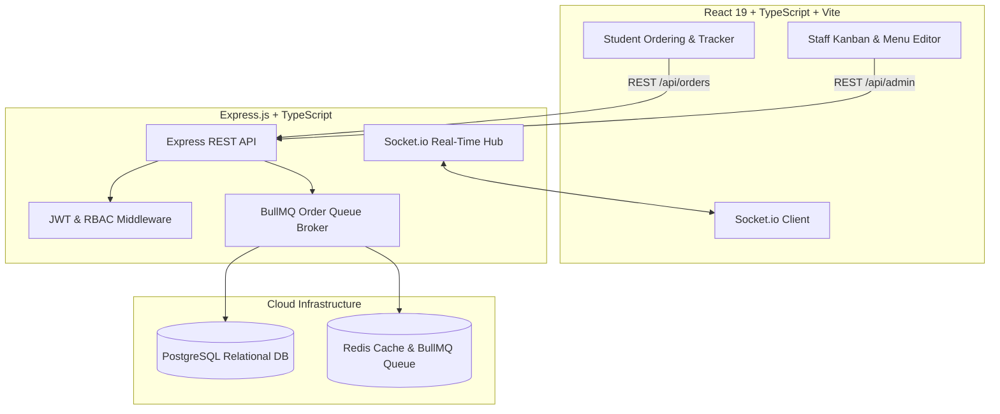

# 🍱 CampusBites — Smart College Canteen Ordering System

[](https://www.typescriptlang.org/)
[](https://react.dev/)
[](https://vitejs.dev/)
[](https://expressjs.com/)
[](https://www.postgresql.org/)
[](https://redis.io/)
[](https://bullmq.io/)
[](https://render.com)

**CampusBites** is a full-stack, real-time college canteen food ordering and kitchen management platform designed to eliminate long lunchtime queues, streamline multi-canteen ordering, and provide live order tracking for students and staff.

---

## ✨ Key Features

### 🎓 For Students
* **Multi-Canteen Selector**: Seamlessly browse menus across multiple campus dining halls (e.g. Canteen A, B, C, D).
* **Calm Hazy Glassmorphic UI**: Ultra-modern frosted-glass design system with smooth Framer Motion interactions.
* **Instant Menu Search & Categorization**: Filter by category (*Snacks*, *Meals*, *Beverages*, *Desserts*) or search in real time.
* **Interactive Cart Drawer**: Adjust item quantities, calculate totals with live taxes, and view summary breakdowns.
* **Live Order Tracking**: Real-time status tracker (Pending $\rightarrow$ Preparing $\rightarrow$ Ready for Pickup) powered by WebSockets.

### 🧑‍🍳 For Kitchen Staff & Canteen Managers
* **Role-Based Access Control (RBAC)**: Distinct permissions for **Admin**, **Canteen Manager**, and **Kitchen Cook**.
* **Live Kanban Kitchen Display System (KDS)**: Drag/tap status updates with instant auditory alerts when new orders arrive.
* **Dynamic Menu Management (CRUD)**: Add dishes, edit prices, upload images, and toggle out-of-stock items in real time.
* **Multi-Tenancy Isolation**: Managers and cooks only see and manage orders for their assigned canteen.

---

## 🏛️ System Architecture



---

## 📂 Project Structure

```
campusbites/
├── backend/                  # Node.js + Express + TypeScript Backend
│   ├── src/
│   │   ├── config/           # Unified environment & Redis config
│   │   ├── controllers/      # Route controllers (Auth, Menu, Order)
│   │   ├── middleware/       # JWT auth, error handling, validation
│   │   ├── queues/           # BullMQ order processing pipeline
│   │   ├── repositories/     # Database access layer
│   │   ├── routes/           # Express route definitions
│   │   ├── services/         # Business logic layer
│   │   ├── utils/            # WebSocket helper & error wrappers
│   │   ├── validators/       # Zod request validation schemas
│   │   ├── db.ts             # PostgreSQL pool & auto-migrations
│   │   └── server.ts         # Server entrypoint
│   ├── .env.example          # Backend environment template
│   └── package.json
├── frontend/                 # React 19 + Vite + Tailwind CSS Frontend
│   ├── src/
│   │   ├── components/       # StudentView, StaffOrders, StaffMenu, StaffLogin
│   │   ├── utils/            # Socket & JWT helpers
│   │   ├── config.ts         # API base URL configuration
│   │   ├── App.tsx           # Main application routing
│   │   └── index.css         # Tailwind & Glassmorphism styles
│   ├── public/
│   │   └── _redirects        # SPA routing rewrite for Render Static Sites
│   ├── .env.example          # Frontend environment template
│   └── package.json
├── docs/                     # Detailed Documentation
│   ├── RENDER_DEPLOYMENT.md  # Step-by-step Render deployment guide
│   ├── API_DOCUMENTATION.md  # REST API & WebSocket specifications
│   ├── ARCHITECTURE.md       # Database schemas & queue lifecycle
│   └── DESIGN.md             # UI/UX design tokens and layout guide
├── render.yaml               # Render Infrastructure-as-Code Blueprint
├── package.json              # Root package with concurrent dev scripts
└── README.md
```

---

## ⚡ Quickstart (Local Development)

### 1. Prerequisites
* [Node.js](https://nodejs.org/) (v18 or higher)
* [PostgreSQL](https://www.postgresql.org/) (or cloud database like Supabase/Neon)
* [Redis](https://redis.io/) (or cloud Redis like Upstash)

### 2. Clone and Install Dependencies
```bash
# Clone the repository
git clone https://github.com/your-username/campusbites.git
cd campusbites

# Install all frontend and backend dependencies
npm run install:all
```

### 3. Configure Environment Variables
* In `backend/`, copy `.env.example` to `.env` and fill in your PostgreSQL and Redis connection URLs:
  ```bash
  cp backend/.env.example backend/.env
  ```
* In `frontend/`, copy `.env.example` to `.env` (default is `http://localhost:5000`):
  ```bash
  cp frontend/.env.example frontend/.env
  ```

### 4. Run Concurrently
```bash
# Run both Frontend and Backend concurrently with live reload
npm run dev
```
* **Frontend**: `http://localhost:5173`
* **Backend API**: `http://localhost:5000`

---

## 🔑 Default Staff Credentials (Demo & Testing)

The database automatically seeds with the following default accounts on first run:

| Username | Password | Role | Assigned Canteen |
|---|---|---|---|
| `admin` | `adminpassword` | **Admin** | All Canteens |
| `canteen_a_mgr` | `1234` | **Manager** | Canteen A |
| `canteen_a_cook` | `1234` | **Cook** | Canteen A |
| `canteen_b_mgr` | `1234` | **Manager** | Canteen B |
| `canteen_c_mgr` | `1234` | **Manager** | Canteen C |
| `canteen_d_mgr` | `1234` | **Manager** | Canteen D |

---

## 🚀 Deployment on Render

CampusBites is ready for deployment on [Render](https://render.com):
1. **Frontend**: Deploy as a **Static Site** with publish directory `dist` and environment variable `VITE_API_URL`.
2. **Backend**: Deploy as a **Web Service** with build command `npm install && npm run build` and start command `npm start`.
3. **Blueprint Support**: Use the included [`render.yaml`](./render.yaml) for 1-click infrastructure deployment.

👉 For complete step-by-step instructions, see the **[Render Deployment Guide](docs/RENDER_DEPLOYMENT.md)**.

---

## 📚 Further Documentation

* 📖 **[API & WebSocket Reference](docs/API_DOCUMENTATION.md)**: Full endpoint definitions, payload examples, and real-time events.
* 🏛️ **[Architecture & Database Guide](docs/ARCHITECTURE.md)**: Relational schema, BullMQ queue pipeline, and RBAC matrix.
* 🎨 **[Design System Specifications](DESIGN.md)**: Glassmorphic tokens, color palette, and micro-interactions.
