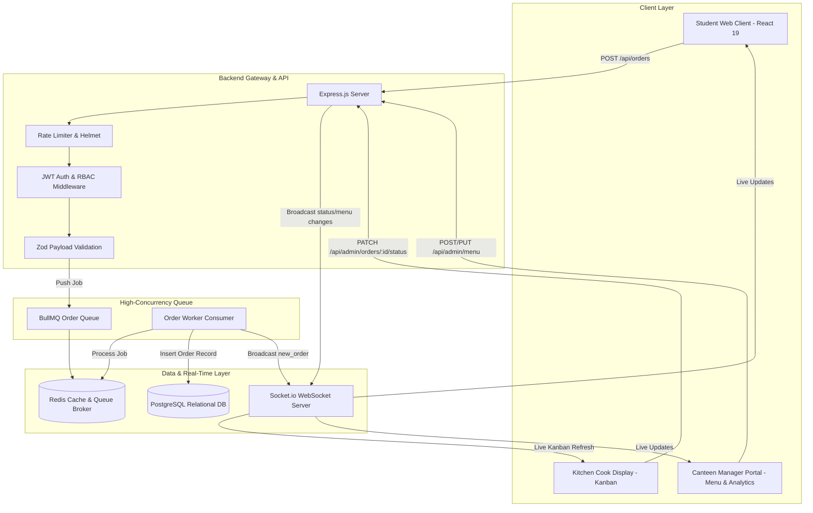
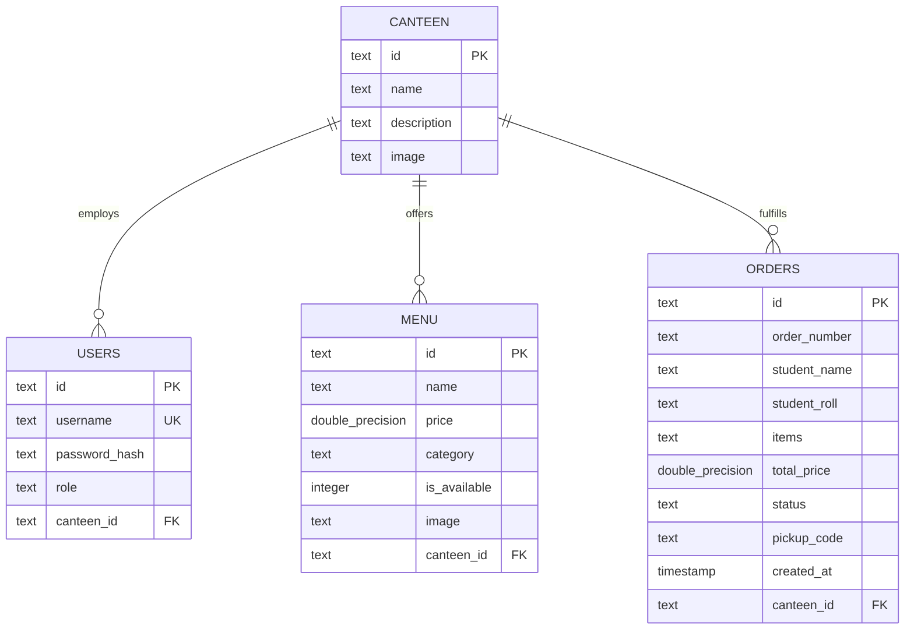

# 🏛️ CampusBites Architecture & Database Specification

This document provides a deep dive into the internal architecture, database schema, background queue processing, and real-time communication pipeline of **CampusBites**.

---

## 🏗️ High-Level System Architecture

---

## 🗄️ Database Relational Schema

CampusBites uses **PostgreSQL** for ACID-compliant transactional consistency.

### Table Definitions

1. **`canteen`**:
   * Represents an independent dining hall or outlet (e.g. Canteen A, Canteen B).
2. **`users`**:
   * Stores canteen personnel with roles (`admin`, `manager`, `cook`).
   * Passwords hashed using `bcrypt` (cost factor 10).
3. **`menu`**:
   * Items linked to a specific `canteen_id`.
   * Categories: `Snacks`, `Beverages`, `Meals`, `Desserts`.
4. **`orders`**:
   * Stores customer information (`student_name`, `student_roll`).
   * `status` state machine: `PENDING` $\rightarrow$ `PREPARING` $\rightarrow$ `READY` $\rightarrow$ `COMPLETED` (or `CANCELLED`).
   * `pickup_code`: Short human-readable identifier (e.g., `PICKUP-1234`).

---

## ⚡ Concurrency & BullMQ Pipeline

During campus lunch breaks, order volume surges. Direct synchronous database writes can cause locks and dropped requests.

### Asynchronous Order Flow:
1. **Submission**: Student submits order via `POST /api/orders`.
2. **Ingestion**: The API enqueues the job into `orderQueue` (BullMQ backed by Redis) and returns immediately.
3. **Worker Processing**:
   * Worker calculates total price server-side from current menu rates (preventing price tampering).
   * Generates order number (`ORD-XXX`) and pickup token.
   * Commits the record to PostgreSQL.
4. **Real-Time Notification**:
   * Emits `new_order` event via Socket.io to the kitchen dashboard for the relevant canteen.
   * Emits confirmation to the student client.

---

## 🛡️ Role-Based Access Control (RBAC)

| Role | Scope | Permissions |
|---|---|---|
| **Admin** (`admin`) | Global (All Canteens) | Full access to all menus, orders, users, and canteen management. |
| **Manager** (`manager`) | Canteen-Scoped | Add/Edit/Delete menu items, adjust prices, toggle item stock, manage orders. |
| **Cook** (`cook`) | Canteen-Scoped | View live orders, advance order status (`PREPARING` $\rightarrow$ `READY` $\rightarrow$ `COMPLETED`). |
