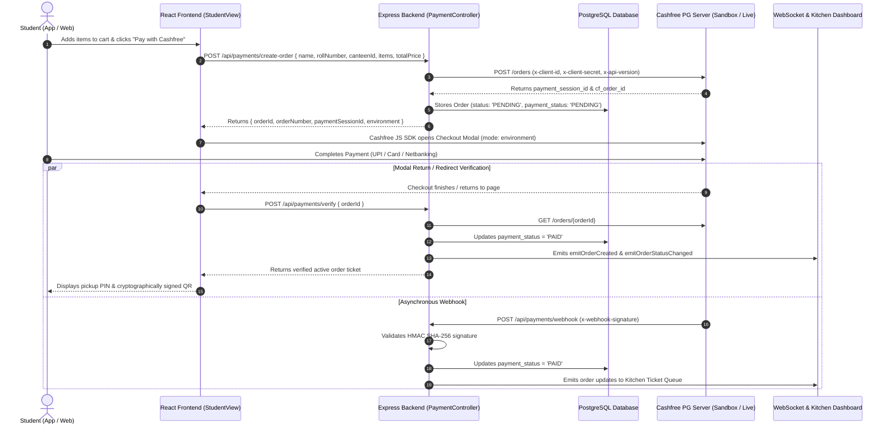

# Cashfree Payment Gateway Integration Guide

Comprehensive technical and operational documentation for the **Cashfree Payment Gateway** in CampusBites.

---

## 📌 Architecture Overview

CampusBites integrates Cashfree's **PG V3 Web Checkout (Redirect & In-App Modal)** alongside real-time WebSocket notifications. The platform supports **Dynamic Environment Switching** between **Sandbox (`TEST`)** and **Production (`PROD`)**.



---

## ⚙️ Environment Configuration

All credentials and runtime switches are managed via environment variables in `backend/.env` and your cloud host (e.g. Render Dashboard):

```env
# ==============================================================================
# Cashfree Payment Gateway Configuration
# ==============================================================================
# Your Cashfree App ID (Client ID)
CASHFREE_APP_ID=your_app_id_here

# Your Cashfree Secret Key (Client Secret)
CASHFREE_SECRET_KEY=your_secret_key_here

# Environment Switch: 'TEST' for Sandbox | 'PROD' for Live Production
CASHFREE_ENV=PROD

# Cashfree API Version (e.g. 2023-08-01)
CASHFREE_API_VERSION=2023-08-01

# Public Frontend URL for return redirects
FRONTEND_URL=https://campusbites-frontend-4jw1.onrender.com
```

### Dynamic Switching Explained:
* When `CASHFREE_ENV=TEST`:
  - Backend targets: `https://sandbox.cashfree.com/pg`
  - Frontend SDK loads with: `mode: "sandbox"`
* When `CASHFREE_ENV=PROD`:
  - Backend targets: `https://api.cashfree.com/pg`
  - Frontend SDK loads with: `mode: "production"`

---

## 📡 API Endpoints Reference

### 1. Create Payment Order Session
* **Endpoint**: `POST /api/payments/create-order`
* **Access**: Public
* **Request Body**:
```json
{
  "name": "Rahul Sharma",
  "rollNumber": "CS2026",
  "canteenId": "c1",
  "items": [
    { "id": "m1", "name": "Paneer Tikka Roll", "price": 80, "quantity": 1 }
  ],
  "totalPrice": 80,
  "phone": "9876543210",
  "email": "student@college.edu"
}
```
* **Response (201 Created)**:
```json
{
  "success": true,
  "data": {
    "orderId": "ord_x7k9p2a1b",
    "orderNumber": "#1042",
    "paymentSessionId": "session_Tdt_E2DEKxkX_N1GgQy9Nr...",
    "cfOrderId": "214899299215296",
    "orderAmount": 80,
    "environment": "production"
  }
}
```

---

### 2. Verify Payment Status
* **Endpoint**: `POST /api/payments/verify`
* **Access**: Public
* **Request Body**:
```json
{
  "orderId": "ord_x7k9p2a1b"
}
```
* **Response (200 OK)**:
```json
{
  "success": true,
  "data": {
    "success": true,
    "status": "PAID",
    "order": {
      "id": "ord_x7k9p2a1b",
      "order_number": "#1042",
      "student_name": "Rahul Sharma",
      "student_roll": "CS2026",
      "total_price": 80,
      "status": "PENDING",
      "pickup_code": "5821",
      "payment_status": "PAID",
      "items": [ ... ],
      "qr_payload": { ... }
    }
  }
}
```

---

### 3. Asynchronous Webhook Receiver
* **Endpoint**: `POST /api/payments/webhook`
* **Access**: Cashfree Server Notifications
* **Headers Verified**: `x-webhook-signature`, `x-webhook-timestamp`
* **Payload Handled**: `ORDER_PAID`, `PAYMENT_SUCCESS_WEBHOOK`, `PAYMENT_FAILED_WEBHOOK`
* **Response**: `{ "status": "OK" }`

---

## 💻 Frontend Implementation Guide

### 1. SDK Script Tag
Included in [`frontend/index.html`](file:///e:/campusbites/frontend/index.html):
```html
<!-- Cashfree Web JS SDK v3 -->
<script src="https://sdk.cashfree.com/js/v3/cashfree.js"></script>
```

### 2. Checkout Modal Trigger ([`StudentView.tsx`](file:///e:/campusbites/frontend/src/components/StudentView.tsx))
```typescript
const sessionData = await response.json();
const { paymentSessionId, orderId, environment } = sessionData;
const checkoutMode = environment === 'production' ? 'production' : 'sandbox';

const win = window as any;
if (paymentSessionId && (win.Cashfree || win.loadCashfree)) {
  let cashfreeInstance: any;
  if (typeof win.Cashfree === 'function') {
    cashfreeInstance = win.Cashfree({ mode: checkoutMode });
  } else if (typeof win.loadCashfree === 'function') {
    cashfreeInstance = await win.loadCashfree({ mode: checkoutMode });
  }

  if (cashfreeInstance) {
    cashfreeInstance.checkout({
      paymentSessionId: paymentSessionId,
      redirectTarget: '_modal', // Sleek in-app popup modal
    }).then(async (result: any) => {
      if (result.error) {
        console.warn('Payment cancelled:', result.error);
        return;
      }
      await verifyAndCompleteOrder(orderId);
    });
  }
}
```

---

## 🔒 Security & Verification

1. **Server-Side Order Creation**:
   API keys (`CASHFREE_SECRET_KEY`) are kept strictly on the backend. The client only receives short-lived `payment_session_id` tokens.
2. **HMAC SHA-256 Webhook Verification**:
   All incoming webhooks compute `crypto.createHmac('sha256', secretKey).update(timestamp + rawBody).digest('base64')` to prevent unauthorized payload tampering.
3. **Double Verification**:
   The frontend automatically calls `/api/payments/verify` immediately upon modal completion to fetch authoritative status directly from Cashfree before issuing QR codes.

---

## 🎨 Brand Assets & Checkout Logos

Vector SVG logos tailored for Cashfree checkout branding and web applications:
* **Square Icon (512x512)**: `frontend/public/campusbites-logo-square.svg`
  - URL: `https://campusbites-frontend-4jw1.onrender.com/campusbites-logo-square.svg`
* **Wide Banner Logo**: `frontend/public/campusbites-logo-wide.svg`
  - URL: `https://campusbites-frontend-4jw1.onrender.com/campusbites-logo-wide.svg`

---

## 🛠️ Maintenance & Key Rotation

To generate a new key or switch between Sandbox/Production:
1. Go to **Cashfree Merchant Dashboard ➔ Developers ➔ API Keys**.
2. Click **Generate New API Key** (and click **Download API Key** to activate).
3. Update `CASHFREE_APP_ID` & `CASHFREE_SECRET_KEY` in:
   - Local: `backend/.env`
   - Render: **Render Dashboard ➔ campusbites service ➔ Environment Variables**.
