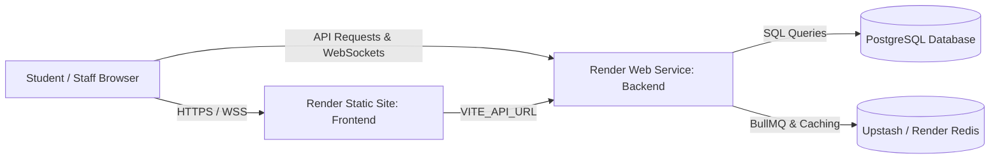

# 🚀 Deploying CampusBites on Render

This guide provides step-by-step instructions for deploying the **CampusBites** full-stack application on [Render](https://render.com).

---

## 📋 System Architecture on Render

---

## 🛠️ Prerequisites

1. A [Render Account](https://render.com).
2. A cloud **PostgreSQL Database** (e.g., [Supabase](https://supabase.com), [Neon](https://neon.tech), or Render PostgreSQL).
3. A cloud **Redis Instance** (e.g., [Upstash Redis](https://upstash.com) or Render Redis).
4. This repository pushed to GitHub or GitLab.

---

## 🚀 Option 1: Automatic Blueprint Deployment (Recommended)

CampusBites includes a [`render.yaml`](../render.yaml) file at the repository root.

1. Navigate to your [Render Dashboard](https://dashboard.render.com/).
2. Click **Blueprints** $\rightarrow$ **New Blueprint Instance**.
3. Connect your repository.
4. Render will detect the `render.yaml` and configure both the **Backend Web Service** and **Frontend Static Site**.
5. Set the required secret environment variables (`DATABASE_URL`, `REDIS_URL`, and `VITE_API_URL`) when prompted.
6. Click **Apply**.

---

## 🔧 Option 2: Manual Deployment via Dashboard

### 1. Deploy the Backend (Web Service)

1. In Render Dashboard, click **New +** $\rightarrow$ **Web Service**.
2. Connect your Git repository.
3. Configure the service:
   * **Name**: `campusbites-backend`
   * **Root Directory**: `backend`
   * **Environment**: `Node`
   * **Build Command**: `npm install && npm run build`
   * **Start Command**: `npm start` (or `node dist/server.js`)
   * **Instance Type**: Free or Starter
4. Add **Environment Variables**:
   | Variable | Value / Description |
   |---|---|
   | `NODE_ENV` | `production` |
   | `PORT` | `10000` (or leave default, Render sets `PORT` automatically) |
   | `JWT_SECRET` | A secure random string (e.g. `openssl rand -hex 32`) |
   | `DATABASE_URL` | Your PostgreSQL connection URI (with `?sslmode=require`) |
   | `REDIS_URL` | Your Upstash Redis URI (`rediss://...`) |
   | `STAFF_PASSWORD` | `admin123` (Fallback staff password) |
5. Click **Create Web Service**.
6. Note down your backend URL (e.g., `https://campusbites-backend.onrender.com`).

---

### 2. Deploy the Frontend (Static Site)

1. In Render Dashboard, click **New +** $\rightarrow$ **Static Site**.
2. Connect your Git repository.
3. Configure the static site:
   * **Name**: `campusbites-frontend`
   * **Root Directory**: `frontend`
   * **Build Command**: `npm install && npm run build`
   * **Publish Directory**: `dist`
4. Add **Environment Variables**:
   | Variable | Value |
   |---|---|
   | `VITE_API_URL` | `https://campusbites-backend.onrender.com` (Your backend URL) |
5. **Redirect / Rewrite Rules**:
   * Ensure `/*` rewrites to `/index.html` (handled automatically via `frontend/public/_redirects`).
6. Click **Create Static Site**.

---

## ⚙️ Cloud Database & Redis Setup

### PostgreSQL (Supabase / Neon / Render Postgres)
* The backend automatically creates necessary tables (`canteen`, `users`, `menu`, `orders`) on server start if they do not exist.
* Default canteens (Canteen A, B, C, D) and staff users are automatically seeded into the database on first boot.
* **Important**: If your database password contains special characters (like `@`, `#`, `[`), URL-encode them in `DATABASE_URL` (e.g., replace `@` with `%40`).

### Redis (Upstash Redis)
* Upstash provides a serverless Redis endpoint with TLS (`rediss://...`).
* The backend (`backend/src/config/redis.ts`) automatically parses TLS options for `rediss://` URLs.
* BullMQ uses this Redis connection for handling the order ingestion queue.

---

## 🔍 Verification & Health Checks

1. **Verify Backend**:
   Visit `https://<backend-url>/api/menu` or `https://<backend-url>/api/canteens` in your browser. You should receive a JSON response with initial canteen/menu items.
2. **Verify Frontend**:
   Open `https://<frontend-url>`.
   * Test adding items to the cart and submitting a test order.
   * Open the staff dashboard at `/staff` or click "Staff Login".
   * Login with username `canteen_a_mgr` and password `1234` (or `admin` / `adminpassword`).
   * Verify real-time order status updates via WebSockets.

---

## 🛠️ Troubleshooting & FAQs

### 1. CORS Errors
* The backend uses `cors()` allowing origins by default. If restricted in production, ensure your frontend Render domain (`https://campusbites-frontend.onrender.com`) is allowed in `backend/src/app.ts`.

### 2. WebSocket Connection Dropping
* Render Web Services support WebSockets natively over HTTPS/WSS.
* Ensure `frontend/src/utils/socket.ts` points to `API_BASE_URL` without hardcoded ports.

### 3. Page Refresh Returns 404 on Frontend
* Render Static Sites require SPA rewrites. Make sure `frontend/public/_redirects` contains `/* /index.html 200`.

### 4. Render Free Tier Spin-Down
* On Render's Free tier, Web Services spin down after 15 minutes of inactivity. Initial requests may take 30-50 seconds to wake up the server. For production college environments, the Starter plan ($7/mo) keeps the backend active 24/7.
