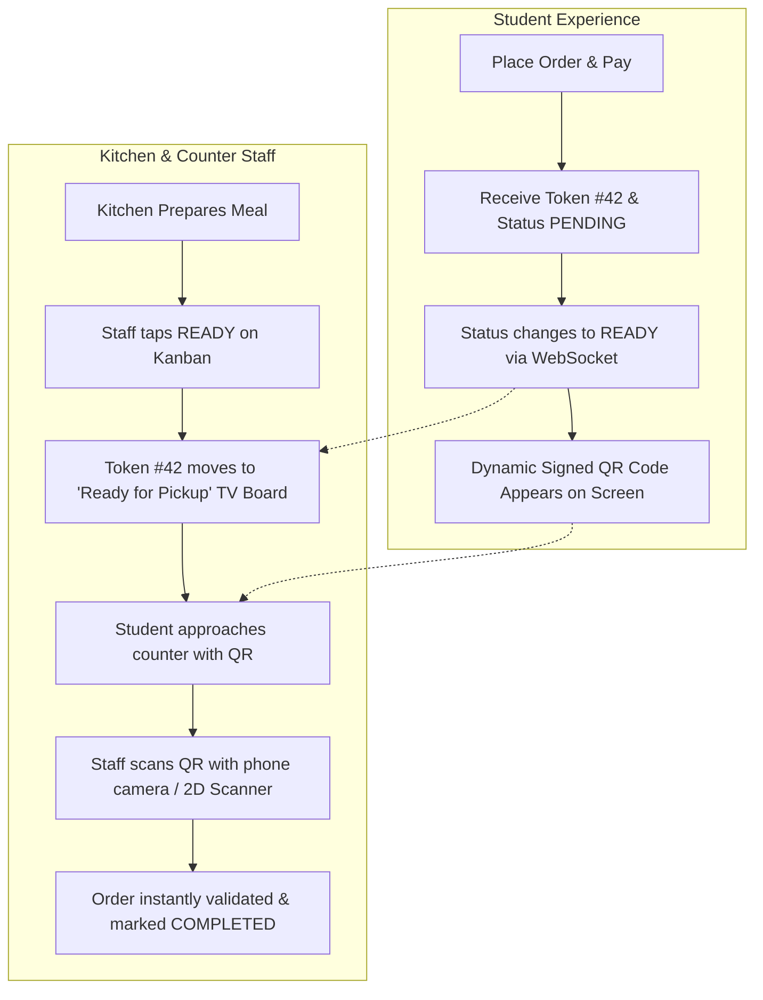
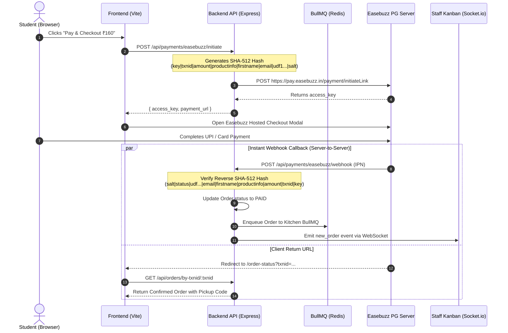

# 🛡️ Hybrid Order Verification & Easebuzz Payment Gateway Integration

This specification details the technical design, security protocol, database schema adjustments, and API flows for:
1. **Hybrid Order Verification** (Visual 3-Digit Queue Token + Scannable Dynamic QR Code)
2. **Table & Canteen Entry QR Codes**
3. **Easebuzz Payment Gateway Integration** (UPI / Cards / NetBanking + Webhooks)

---

## 🎯 Part 1: Hybrid Order Verification System

### The Problem
During peak canteen rush (15–20 minute college breaks), 300+ students attempt to pick up meals simultaneously:
* **SMS OTPs** create huge delays due to poor campus cell reception and typing friction.
* **Pure number callouts** create fraud risk (students claiming food that isn't theirs).

### The Hybrid Solution


### 1. Verification Token & QR Specifications

#### A. Visual Queue Token (Counter Board)
* **Format**: Short alphanumeric or rotating daily integer (e.g. `#042` or `A-19`).
* **Purpose**: Kitchen staff call the number or show it on a wall display TV.
* **Storage**: Column `order_number` in `orders` table.

#### B. Dynamic Verification QR Code
* **Format**: Standard QR 200x200px containing a cryptographically verifiable payload.
* **QR Content**:
  ```json
  {
    "order_id": "ord_1720000000_abc123",
    "order_number": "ORD-042",
    "canteen_id": "c1",
    "pickup_code": "PICKUP-8921",
    "signature": "hmac_sha256(order_id + pickup_code, JWT_SECRET)"
  }
  ```
* **Security**:
  * Prevents students from forging order IDs or re-using old screenshots.
  * Backend verifies HMAC signature and confirms order is currently in `READY` status.
  * Once scanned, order transitions to `COMPLETED` and subsequent scans fail with `"Order Already Picked Up"`.

---

## 🪑 Part 2: Table & Canteen Entry QR Generation

Place static QR codes on dining tables or canteen entrance banners.

### URL Structure:
```
https://campusbites.onrender.com/?canteen=c1&table=T12
```

### Flow:
1. Student scans table sticker with native smartphone camera.
2. Browser opens the app with `canteen_id=c1` and `table_number=T12` pre-filled.
3. When order is placed, `table_number` is attached to the order metadata so staff know if it's table-served or counter pickup.

---

## 💳 Part 3: Easebuzz Payment Gateway Architecture

Easebuzz is a major Indian payment aggregator supporting **UPI (Google Pay, PhonePe, Paytm), Credit/Debit Cards, NetBanking, and Wallets**.



---

## 🔐 Easebuzz Security & Checksum Algorithm

### 1. Request Hash Calculation (SHA-512)
```ts
import crypto from 'crypto';

function generateInitiateHash({
  key,
  txnid,
  amount,
  productinfo,
  firstname,
  email,
  udf1 = '',
  udf2 = '',
  udf3 = '',
  udf4 = '',
  udf5 = '',
  salt
}: EasebuzzInitiateParams): string {
  const hashString = `${key}|${txnid}|${amount}|${productinfo}|${firstname}|${email}|${udf1}|${udf2}|${udf3}|${udf4}|${udf5}||||||${salt}`;
  return crypto.createHash('sha512').update(hashString).digest('hex');
}
```

### 2. Webhook / Response Hash Verification
```ts
function verifyResponseHash(resData: any, salt: string): boolean {
  const {
    key,
    txnid,
    amount,
    productinfo,
    firstname,
    email,
    status,
    hash,
    udf1 = '',
    udf2 = '',
    udf3 = '',
    udf4 = '',
    udf5 = ''
  } = resData;

  const reverseHashString = `${salt}|${status}||||||${udf5}|${udf4}|${udf3}|${udf2}|${udf1}|${email}|${firstname}|${productinfo}|${amount}|${txnid}|${key}`;
  const calculatedHash = crypto.createHash('sha512').update(reverseHashString).digest('hex');
  
  return calculatedHash.toLowerCase() === hash.toLowerCase();
}
```

---

## 📋 Database Schema Updates for Payments & QR

To store payment transaction IDs and verification status, the `orders` table is extended:

```sql
ALTER TABLE orders ADD COLUMN IF NOT EXISTS payment_status TEXT DEFAULT 'PENDING'; -- 'PENDING', 'PAID', 'FAILED', 'REFUNDED'
ALTER TABLE orders ADD COLUMN IF NOT EXISTS payment_txnid TEXT;
ALTER TABLE orders ADD COLUMN IF NOT EXISTS payment_mode TEXT; -- 'UPI', 'CARD', 'NETBANKING', 'CASH'
ALTER TABLE orders ADD COLUMN IF NOT EXISTS table_number TEXT;
ALTER TABLE orders ADD COLUMN IF NOT EXISTS qr_signature TEXT;
ALTER TABLE orders ADD COLUMN IF NOT EXISTS verified_at TIMESTAMP;
ALTER TABLE orders ADD COLUMN IF NOT EXISTS verified_by TEXT;
```

---

## 🛠️ Easebuzz Environment Variables

Add to `backend/.env`:
```env
# Easebuzz Payment Gateway Configuration
EASEBUZZ_MERCHANT_KEY=your_merchant_key
EASEBUZZ_SALT=your_merchant_salt
EASEBUZZ_ENV=test # 'test' for sandbox (https://testpay.easebuzz.in), 'prod' for production (https://pay.easebuzz.in)
EASEBUZZ_WEBHOOK_URL=https://your-backend.onrender.com/api/payments/easebuzz/webhook
```
