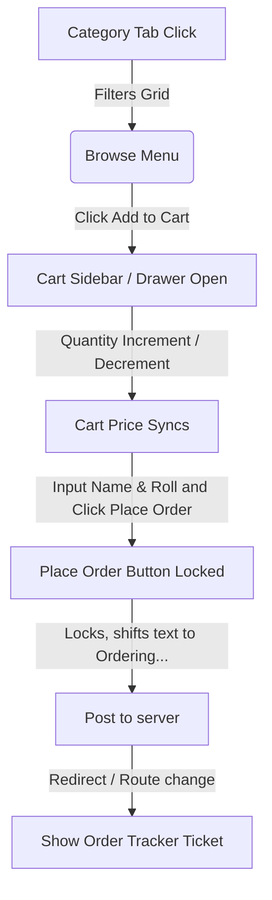
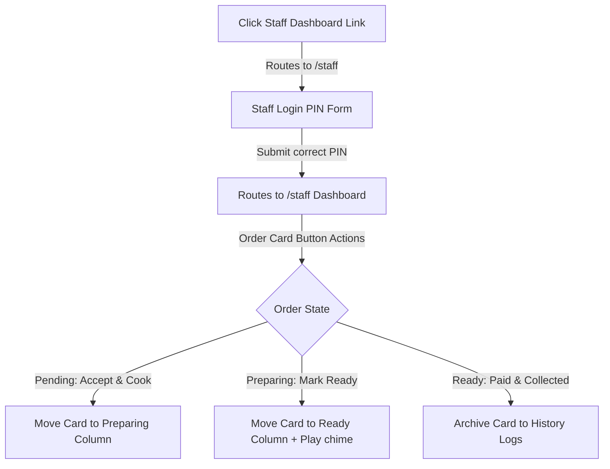

# CampusBites Canteen Selector - UI/UX & Interaction Design Specification

This document details the visual style, design system, component behaviors, interactive button connectivity, and user flows of the CampusBites web application. It acts as the definitive design blueprint ("Design DNA") for generating high-fidelity modern UI interfaces using Google Stitch.

---

## 1. Visual Design DNA (Light Glassmorphism)

The application is built on a premium, clean slate-indigo light theme, overlaying an interactive, liquid gradient background:

### 1.1. Background Hierarchy
*   **Primary Canvas Background:** `#F8FAFC` (Slate 50) - Body background wrapper.
*   **Elevated Surfaces:** `#FFFFFF` (Pure White) - Card backings and sidebars.
*   **Translucent Surface Glass:** `rgba(255, 255, 255, 0.45)` - Used for glassmorphic elements.

### 1.2. Interactive Cursor Swoosh Cloud
An interactive, fluid background component must follow the cursor to bring the light canvas to life:
*   **Swoosh Cloud Properties:**
    *   Renders a blurred color-gradient cloud behind the glassmorphic content.
    *   `Background Gradient:` `radial-gradient(circle, rgba(99, 102, 241, 0.25) 0%, rgba(244, 63, 94, 0.15) 50%, transparent 100%)`
    *   `Filter:` `blur(80px)`
    *   `Dimensions:` `500px` by `500px` (or dynamic scale based on viewport size).
    *   `CSS Transition:` Smooth, spring-like lag interpolation (e.g., `transition: transform 0.2s cubic-bezier(0.25, 1, 0.5, 1)`) as it moves.
    *   `Pointer Events:` `none` to ensure no interaction blocking.

### 1.3. Glassmorphic Surface Specifications
*   **Glass Card class (`.glass-card`):**
    ```css
    backdrop-filter: blur(12px);
    background-color: rgba(255, 255, 255, 0.45);
    border: 1px solid rgba(15, 23, 42, 0.06);
    box-shadow: 0 10px 25px -5px rgba(0, 0, 0, 0.05), 0 8px 10px -6px rgba(0, 0, 0, 0.05);
    ```
*   **Glass Nav class (`.glass`):**
    ```css
    backdrop-filter: blur(16px);
    background-color: rgba(255, 255, 255, 0.6);
    border-bottom: 1px solid rgba(15, 23, 42, 0.05);
    ```

---

## 2. Component Specifications & Button States

Stitch must apply these specific styles, interactive micro-animations, and visual states across UI elements:

### 2.1. Food Item Cards
*   **Base Style:** Styled with `.glass-card`. Contains product image, name, category badge, price tag, and action triggers.
*   **Hover State:** 
    *   Scale up slightly (`scale-[1.02]`) on pointer hover.
    *   Card border transitions from `rgba(15, 23, 42, 0.06)` to `rgba(79, 70, 229, 0.30)`.
    *   Product image inside overflow-hidden container scales up (`scale-105`) with a `500ms ease` transition.
*   **Out of Stock State:**
    *   Card opacity decreases to `50%` (`opacity-50`).
    *   Grayscale filter applied to product image.
    *   Action button replaced with a disabled "Out of Stock" badge (`text-text-muted`, `bg-slate-100`).

### 2.2. Category Filter Tabs
*   **Base Style:** Segmented pill bar.
*   **Active Tab:** Displays solid brand-primary background (`bg-brand-primary` / `#4F46E5`) with white text.
*   **Inactive Tab:** Translucent grey background (`bg-slate-100/60` / `rgba(241, 245, 249, 0.6)`).
*   **Hover Tab State:** Shifts to semi-transparent overlay (`rgba(15, 23, 42, 0.04)`) with smooth `200ms` transition.

### 2.3. Custom Toggle Switches (e.g. Menu Item Availability)
*   **Active State (In Stock):** Background transitions to green (`bg-status-success` / `#10B981`). The sliding white indicator ball shifts right (`translate-x-full`).
*   **Inactive State (Out of Stock):** Background returns to neutral grey (`bg-slate-200`). White ball resets (`translate-x-0`).
*   **Transition:** `200ms cubic-bezier(0.4, 0, 0.2, 1)` duration on both background color and transform.

### 2.4. General Buttons (Indigo Theme)
*   **Brand Button:** Solid `#4F46E5`, white text. Hovers to `#4338CA`. Active tap scales down to `98%` (`active:scale-98`).
*   **Outline Button:** Border `#4F46E5` (`border-2`), transparent background. Hovers to `#4F46E5` with white text.
*   **Subtle/Ghost Button:** Text `#4F46E5`, transparent background. Hovers to `rgba(79, 70, 229, 0.08)`.

---

## 3. Button Connectivity & Interactive Flows

This section documents the navigation actions, state changes, and routing maps triggered by button interactions:

### 3.1. Student Browse & Checkout Flow


#### 3.1.1. Add-to-Cart Action
*   **Interaction:** Clicking "Add to Cart" triggers a cross-fade transition replacing the button with a "+ / -" quantity controller.
*   **Badge Action:** The cart icon badge springs up (`scale-110` to `scale-100`) as item counts update.
*   **Mobile Behavior:** The floating bag action button springs/animates into view. Clicking it opens the bottom-sheet Cart Drawer.

#### 3.1.2. Checkout Form Submission
*   **Validation Check:** Clicking "Place Order" validates the **Name** and **Roll Number** inputs. If empty, the input fields highlight with red borders (`border-status-error`) and shake.
*   **Submission Lockout:** If inputs are valid, the "Place Order" button disables, its text changes to "Ordering...", and a spinner rotates inside it to prevent duplicate orders.
*   **Success Routing:** On API success, the student is redirected to the **Order Tracker View** via a React Router state transition.

#### 3.1.3. Order Tracker Interaction
*   **Pickup Code Presentation:** A unique 4-digit code is formatted in monospace Courier font inside a high-contrast ticket container.
*   **QR Code Toggle:** A button renders the ticket QR code. The QR code container features a solid white backing border (`bg-white p-2`) to ensure scanner readability.
*   **"Back to Menu" Link:** A secondary button redirects the student to the Browse Menu view without clearing active sessions.

---

### 3.2. Staff Authentication & Kanban Flow


#### 3.2.1. Login Portal
*   **Action:** Inputting the PIN code and clicking "Login" invokes verification.
*   **Loader Feedback:** The login button turns disabled, displays "Verifying...", and runs a loader spinner.
*   **Error State:** If verification fails, a red warning banner slides down (`translate-y-0`) displaying an error message.

#### 3.2.2. Kanban Dashboard Operations
*   **Column 1 (Pending) -> "Accept & Cook" Button:**
    *   Clicking shifts the order status to `PREPARING`.
    *   Order card slides out of Column 1 and fades into Column 2.
*   **Column 2 (Preparing) -> "Mark Ready" Button:**
    *   Clicking shifts order status to `READY`.
    *   Card moves to Column 3.
    *   Sound chime plays automatically to notify the counter staff/student.
*   **Column 3 (Ready) -> "Paid & Collected" Button:**
    *   Clicking shifts order status to `COMPLETED`.
    *   Card fades out entirely, archiving it to the History database table.
*   **Dashboard Tab Switcher:**
    *   Clicking "Active Orders" displays the 3-column Kanban board.
    *   Clicking "Completed History" switches the view to a static tabular list of archived transactions.

#### 3.2.3. Menu Inventory Management
*   **"Add New Item" Button:** Launches a modal panel with a blurred backdrop (`glass-overlay`).
*   **Stock Status Slider Toggle:** Allows staff to instantly flip item availability. Toggling it sends an immediate patch request, disabling the item on the Student view.
*   **CRUD Form Buttons:**
    *   "Save Changes" button: submits form, closes modal with a fade-out animation.
    *   "Cancel / Close" button: discards changes, closes modal instantly.
    *   "Delete Item" button: prompts a secondary confirmation dialog before executing.

---

## 4. Typography & Spacing Hierarchy

Fonts must align with these size, weight, and spacing tokens to preserve high geometric legibility:

*   **Display Headings:** `Outfit` (weights: 600/700, tracked tight `-0.025em`).
*   **Body & Input Text:** `Inter` (weights: 400/500/600).
*   **Order Codes/OTP:** `Courier New` / Monospace (weight: 700).
*   **Small Metadata:** Set to uppercase with letters tracked slightly wider (`tracking-wider` / `0.05em`).
*   **Grid Gaps:** Desktop uses `gap-6` (`24px`). Mobile uses `gap-4` (`16px`).

---

## 5. Transition & Motion Curves

Stitch must use these specific animation properties on all visual components:

*   **Base Hover Transition:** `200ms ease-out` (applies to buttons, links, segmented tabs).
*   **Card Scale Curves:** `300ms cubic-bezier(0.16, 1, 0.3, 1)` (smooth deceleration curve).
*   **Drawer Slide-ups:** `300ms cubic-bezier(0.16, 1, 0.3, 1)` sliding vertically along the Y-axis.
*   **Choreography Delay:** Sequential list entries must fade-in using staggered delays (`50ms` increments).
