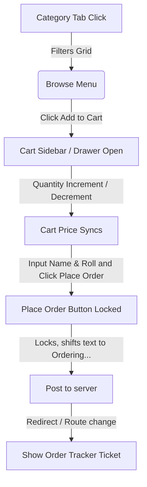
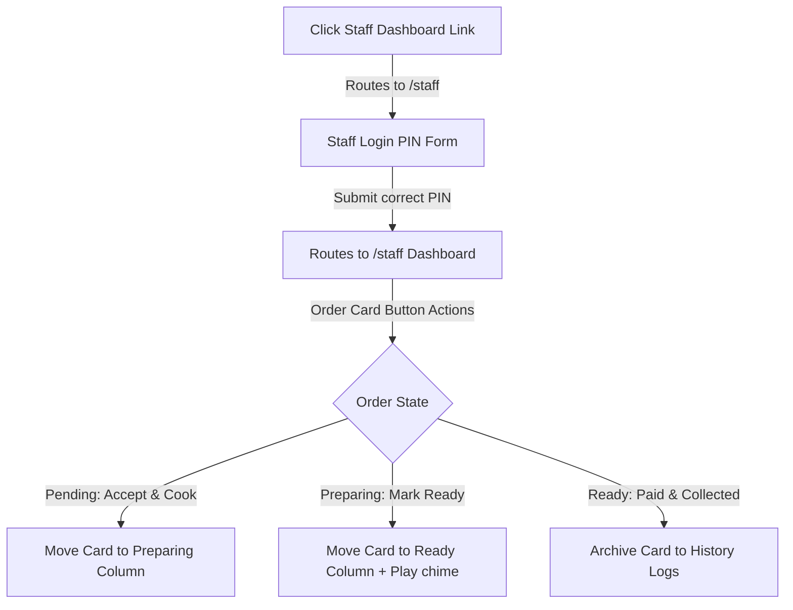

# CampusBites Canteen Selector - UI/UX & Interaction Design Specification

This document details the visual style, design system, component behaviors, interactive button connectivity, and user flows of the CampusBites web application. It acts as the definitive design blueprint ("Design DNA") for generating high-fidelity modern UI interfaces using Google Stitch.

---

## 1. Visual Design DNA (Hazy Light Glassmorphism)

The application features a calm, light, tactile glass interface. By combining diffuse background pastel clouds with high-depth blur filters and fine grain structures, components appear as if they are etched directly onto sheets of frosted glass.

### 1.1. Background Hierarchy & Diffuse Blob System
To achieve a calm, hazy color appearance, the layout sits on a light background illuminated by large, slow-moving, or static blurred gradient vectors:

*   **Primary Canvas Background:** `#FAF9FB` (Soft, off-white background with a hint of lavender).
*   **Tactile Grain Overlay:** A global fullscreen noise overlay with a fine-grain pattern to give the glass elements a physical texture.
    ```css
    /* SVG Noise Background to create the grainy glass texture */
    background-image: url("data:image/svg+xml,%3Csvg viewBox='0 0 200 200' xmlns='http://www.w3.org/2000/svg'%3E%3Cfilter id='noiseFilter'%3E%3CfeTurbulence type='fractalNoise' baseFrequency='0.75' numOctaves='3' stitchTiles='stitch'/%3E%3C/filter%3E%3Crect width='100%25' height='100%25' filter='url(%23noiseFilter)' opacity='0.025'/%3E%3C/svg%3E");
    ```
*   **Hazy Ambient Blobs (Underlay):**
    Three large, organic, overlapping circular gradients float behind the main layout containers. They are heavily blurred to create a soft, dream-like canvas where colors look hazy, as if viewed through thick frosted glass:
    *   `Blob A (Lavender):` `radial-gradient(circle at 20% 30%, rgba(165, 180, 252, 0.18) 0%, transparent 60%)` with `filter: blur(120px)`.
    *   `Blob B (Rose):` `radial-gradient(circle at 80% 40%, rgba(244, 143, 177, 0.14) 0%, transparent 60%)` with `filter: blur(140px)`.
    *   `Blob C (Mint):` `radial-gradient(circle at 50% 80%, rgba(167, 243, 208, 0.11) 0%, transparent 70%)` with `filter: blur(120px)`.

### 1.2. Frosted Glass Specifications
Layout modules and cards rely on high-blur properties and white highlight borders to stand out from the hazy background:
*   **Frosted Glass Card (`.glass-card`):**
    ```css
    backdrop-filter: blur(24px) saturate(140%);
    background-color: rgba(255, 255, 255, 0.35);
    border-top: 1px solid rgba(255, 255, 255, 0.45);
    border-left: 1px solid rgba(255, 255, 255, 0.45);
    border-bottom: 1px solid rgba(15, 23, 42, 0.03);
    border-right: 1px solid rgba(15, 23, 42, 0.03);
    box-shadow: 0 8px 32px 0 rgba(31, 38, 135, 0.03), 
                inset 0 1px 0 rgba(255, 255, 255, 0.2);
    ```
*   **Frosted Glass Navigation (`.glass`):**
    ```css
    backdrop-filter: blur(16px);
    background-color: rgba(255, 255, 255, 0.55);
    border-bottom: 1px solid rgba(255, 255, 255, 0.3);
    ```

---

## 2. Component Specifications & Button States

Stitch must apply these specific styles, interactive micro-animations, and visual states across UI elements:

### 2.1. Food Item Cards
*   **Base Style:** Encased in a `.glass-card`. Contains product image, name, category badge, price tag, and quantity controls.
*   **Hover State:** 
    *   Card scales up slightly (`scale-[1.01]`) with a smooth transition.
    *   Borders transition from translucent white (`rgba(255, 255, 255, 0.45)`) to a soft indigo-tinted glass glow (`rgba(79, 70, 229, 0.2)`).
    *   Product image inside the overflow-hidden card top scales up slightly (`scale-103`) with a `400ms ease-out` transition.
*   **Out of Stock State:**
    *   Card opacity decreases to `60%` (`opacity-60`).
    *   Subtle grayscale filter (`grayscale-[40%]`) applied to the food image.
    *   Action button replaced with a disabled "Out of Stock" glass tab (`text-text-muted`, border `white/20`, background `white/10`).

### 2.2. Category Filter Tabs
*   **Base Style:** Segmented pill bar utilizing frosted glass backgrounds.
*   **Active Tab:** Displays a glossy glass background with a subtle color gradient (`linear-gradient(135deg, rgba(79, 70, 229, 0.15) 0%, rgba(244, 143, 177, 0.1) 100%)`), outlined with a white border (`border-white/50`), and dark indigo text (`text-brand-primary` / `#4F46E5`).
*   **Inactive Tab:** Clean translucent backing (`rgba(255, 255, 255, 0.25)`).
*   **Hover Tab State:** Shifts to a soft translucent overlay (`rgba(15, 23, 42, 0.03)`) with a `200ms` transition.

### 2.3. Custom Toggle Switches (e.g. Menu Item Availability)
*   **Active State (In Stock):** Background transitions to a soft emerald glass gradient (`linear-gradient(135deg, rgba(16, 185, 129, 0.25) 0%, rgba(52, 211, 153, 0.1) 100%)`). The sliding white indicator ball shifts right (`translate-x-full`).
*   **Inactive State (Out of Stock):** Background returns to neutral translucent grey (`rgba(15, 23, 42, 0.08)`). White ball resets (`translate-x-0`).
*   **Transition:** `250ms cubic-bezier(0.25, 1, 0.5, 1)` duration on both background color and translate transform.

---

### 2.4. Glossy Glass Buttons
Buttons are styled to look like polished, reflective glass sheets with soft color gradients:

#### 2.4.1. Primary Action Button (e.g., Checkout / Add Item)
*   **Glossy Gradient Background:**
    ```css
    background: linear-gradient(135deg, rgba(129, 140, 248, 0.2) 0%, rgba(244, 143, 177, 0.15) 100%);
    position: relative;
    overflow: hidden;
    ```
*   **Glossy Sheen Overlay:** A white-to-transparent highlight overlay in a `:before` pseudo-element representing the glass reflection:
    ```css
    content: "";
    position: absolute;
    top: 0; left: 0; right: 0;
    height: 50%;
    background: linear-gradient(to bottom, rgba(255, 255, 255, 0.35) 0%, rgba(255, 255, 255, 0) 100%);
    pointer-events: none;
    ```
*   **Border:** `1px solid rgba(255, 255, 255, 0.5)`.
*   **Shadow:** `0 4px 16px -2px rgba(99, 102, 241, 0.08)`.
*   **Text Color:** Deep Indigo-slate (`#312E81` / `hsl(243, 75%, 25%)`).
*   **Hover State:** Gradient glows brighter (`linear-gradient(135deg, rgba(129, 140, 248, 0.3) 0%, rgba(244, 143, 177, 0.25) 100%)`), border updates to `rgba(255, 255, 255, 0.7)`.
*   **Tap State:** Scales down slightly (`active:scale-98`).

#### 2.4.2. Secondary Action Button (e.g., Close Modal / Back to Menu)
*   **Style:** Translucent white gradient (`linear-gradient(135deg, rgba(255, 255, 255, 0.4) 0%, rgba(255, 255, 255, 0.15) 100%)`), thin white border (`1px solid rgba(255, 255, 255, 0.45)`), and slate text (`#475569`).
*   **Hover State:** Shifts to `rgba(255, 255, 255, 0.55)` with an inner reflection highlight.

#### 2.4.3. Status-Driven Action Buttons (Staff Panel)
*   **Accept & Cook Button (Pending):**
    *   `Background:` `linear-gradient(135deg, rgba(253, 230, 138, 0.25) 0%, rgba(252, 211, 77, 0.08) 100%)`
    *   `Border:` `1px solid rgba(255, 255, 255, 0.5)`
    *   `Text Color:` `#92400E` (Amber 800)
*   **Mark Ready Button (Preparing):**
    *   `Background:` `linear-gradient(135deg, rgba(110, 231, 183, 0.25) 0%, rgba(52, 211, 153, 0.08) 100%)`
    *   `Border:` `1px solid rgba(255, 255, 255, 0.5)`
    *   `Text Color:` `#065F46` (Emerald 800)
*   **Delete Button (Danger):**
    *   `Background:` `linear-gradient(135deg, rgba(252, 165, 165, 0.25) 0%, rgba(248, 113, 113, 0.08) 100%)`
    *   `Border:` `1px solid rgba(255, 255, 255, 0.5)`
    *   `Text Color:` `#991B1B` (Red 800)

---

## 3. Button Connectivity & Interactive Flows

This section documents the navigation actions, state changes, and routing maps triggered by button interactions:

### 3.1. Student Browse & Checkout Flow


#### 3.1.1. Add-to-Cart Action
*   **Interaction:** Clicking "+ Add to Cart" triggers a cross-fade transition replacing the button with a "+ / -" quantity controller.
*   **Badge Action:** The cart icon badge springs up (`scale-110` to `scale-100`) as item counts update.
*   **Mobile Behavior:** The floating bag action button springs/animates into view. Clicking it opens the bottom-sheet Cart Drawer.

#### 3.1.2. Checkout Form Submission
*   **Validation Check:** Clicking the primary glossy checkout button validates the **Name** and **Roll Number** inputs. If empty, the input fields highlight with red borders (`border-status-error` / `rgba(220, 38, 38, 0.4)`) and apply a shake animation.
*   **Submission Lockout:** If inputs are valid, the checkout button disables, its text changes to "Ordering...", and a spinner rotates inside it to prevent duplicate orders.
*   **Success Routing:** On API success, the student is redirected to the **Order Tracker View** via a React Router state transition.

#### 3.1.3. Order Tracker Interaction
*   **Pickup Code Presentation:** A unique 4-digit code is formatted in monospace Courier font inside a high-contrast ticket container.
*   **QR Code Toggle:** A button renders the ticket QR code. The QR code container features a solid white backing border (`bg-white p-2`) to ensure scanner readability.
*   **"Back to Menu" Link:** A secondary button redirects the student to the Browse Menu view without clearing active sessions.

---

### 3.2. Staff Authentication & Kanban Flow


#### 3.2.1. Login Portal
*   **Action:** Inputting the PIN code and clicking "Login" invokes verification.
*   **Loader Feedback:** The login button turns disabled, displays "Verifying...", and runs a loader spinner.
*   **Error State:** If verification fails, a red warning banner slides down (`translate-y-0`) displaying an error message.

#### 3.2.2. Kanban Dashboard Operations
*   **Column 1 (Pending) -> "Accept & Cook" Button:**
    *   Clicking shifts the order status to `PREPARING`.
    *   Order card slides out of Column 1 and fades into Column 2.
*   **Column 2 (Preparing) -> "Mark Ready" Button:**
    *   Clicking shifts order status to `READY`.
    *   Card moves to Column 3.
    *   Sound chime plays automatically to notify the counter staff/student.
*   **Column 3 (Ready) -> "Paid & Collected" Button:**
    *   Clicking shifts order status to `COMPLETED`.
    *   Card fades out entirely, archiving it to the History database table.
*   **Dashboard Tab Switcher:**
    *   Clicking "Active Orders" displays the 3-column Kanban board.
    *   Clicking "Completed History" switches the view to a static tabular list of archived transactions.

#### 3.2.3. Menu Inventory Management
*   **"Add New Item" Button:** Launches a modal panel with a blurred backdrop (`glass-overlay`).
*   **Stock Status Slider Toggle:** Allows staff to instantly flip item availability. Toggling it sends an immediate patch request, disabling the item on the Student view.
*   **CRUD Form Buttons:**
    *   "Save Changes" button: submits form, closes modal with a fade-out animation.
    *   "Cancel / Close" button: discards changes, closes modal instantly.
    *   "Delete Item" button: prompts a secondary confirmation dialog before executing.

---

## 4. Layout & Grid Specifications (Responsive Ratios)

Stitch must preserve these grid ratios and layout behaviors across screen size changes:

### 4.1. Responsive Breakpoints
*   **Mobile Screen (< 768px):** Single column layout. Sidebars (like the Cart drawer) collapse into bottom sheet overlays.
*   **Tablet Screen (768px - 1024px):** Standard grid structures scale down; the menu grid adjusts to a 2-column layout.
*   **Desktop & Laptop Screens (> 1024px):** Split columns. The sidebar cart is locked as a sticky column beside the menu grid.

### 4.2. Grids & Panels Layout
*   **Main Header:** Height fixed to `64px` (`py-3`). Content aligned using flexbox (`justify-between`).
*   **Food Menu Grid:** Set to standard CSS grid.
    *   Desktop/Laptop: `grid-cols-3` with `gap-5`.
    *   Tablet: `grid-cols-2` with `gap-5`.
    *   Mobile: `grid-cols-1` with `gap-4`.
*   **Cart Drawer Sidebar:** Max width set to `320px` (`w-80`). Vertical sizing must be constrained using `max-h-[calc(100vh-140px)]` to prevent footer clipping.
*   **Kanban Board (Staff):** Uses `grid-cols-3` with `gap-6` on desktop/laptop. Each column wrapper is set to a fixed height limit of `70vh` (`max-h-[70vh]`) and has scroll overflow `overflow-y-auto` enabled. This guarantees all 3 columns stay aligned on one screen.

---

## 5. Typography & Spacing Hierarchy

Fonts must align with these size, weight, and spacing tokens to preserve high geometric legibility and design quality:

*   **Display Headings:** `Outfit` (weights: 600/700, tracked tight `-0.025em`).
*   **Body & Input Text:** `Inter` (weights: 400/500/600).
*   **Order Codes/OTP:** `Courier New` / Monospace (weight: 700).
*   **Small Metadata:** Set to uppercase with letters tracked slightly wider (`tracking-wider` / `0.05em`).
*   **Grid Gaps:** Desktop uses `gap-6` (`24px`). Mobile uses `gap-4` (`16px`).

---

## 6. Transition & Motion Curves

Stitch must use these specific animation properties on all visual components:

*   **Base Hover Transition:** `200ms ease-out` (applies to buttons, links, segmented tabs).
*   **Card Scale Curves:** `300ms cubic-bezier(0.16, 1, 0.3, 1)` (smooth deceleration curve).
*   **Drawer Slide-ups:** `300ms cubic-bezier(0.16, 1, 0.3, 1)` sliding vertically along the Y-axis.
*   **Choreography Delay:** Sequential list entries must fade-in using staggered delays (`50ms` increments).
