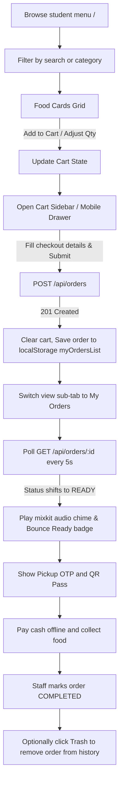
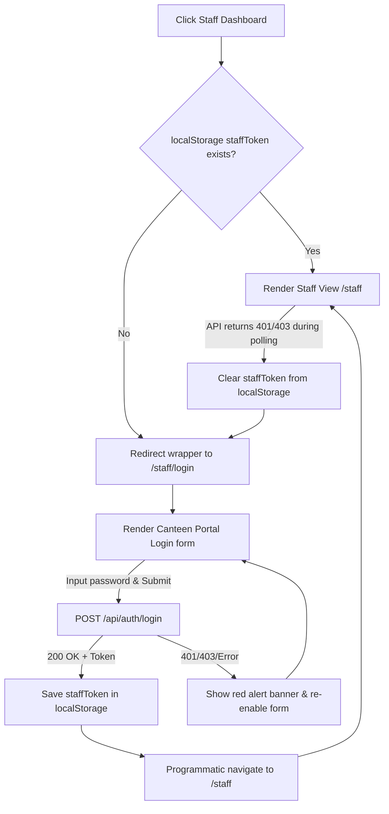

# Routing & Navigation Connectivity Master Sheet

This document details the routing architecture, navigation links, session tracking state rules, redirection guards, and transition behaviors of the CampusBites Canteen Hub application.

---

## 1. Routing Architecture & Protected Paths

The application uses **React Router DOM** for client-side routing. Navigation is driven by a nested layout structure that handles state validation and redirection.

```
       [Public Home View] (/)
               │
               ├─► [Staff Login Portal] (/staff/login)
               │
               └─► [Protected Staff Wrapper] (/staff) (Route Guard: StaffView.tsx)
                           │
                           ├──► [Orders Dashboard] (/staff) (Index route)
                           │
                           └──► [Menu CRUD Editor] (/staff/menu)
```

### 1.1. Redirection & Guard Rules

| Route | Access Type | Wrapper / Guard | Redirection Rule |
|:---|:---|:---|:---|
| `/` | Public | None (Renders `StudentView.tsx`) | None. |
| `/staff/login` | Public | None (Renders `StaffLogin.tsx`) | None. |
| `/staff` | Protected | Wrapped in `StaffView.tsx` | If `staffToken` is **missing** in `localStorage`, redirect to `/staff/login` using a router `<Navigate replace />`. |
| `/staff/menu` | Protected | Wrapped in `StaffView.tsx` | If `staffToken` is **missing** in `localStorage`, redirect to `/staff/login` using a router `<Navigate replace />`. |

### 1.2. Session Token Details
- **Token Name:** `staffToken`
- **Storage Location:** `localStorage`
- **Creation:** Saved upon a successful `POST /api/auth/login` request.
- **Destruction:** Removed upon clicking the **Logout** button (calls `localStorage.removeItem('staffToken')`) or when any protected admin request returns a `401 Unauthorized` or `403 Forbidden` response.

---

## 2. Page Navigation Matrix

This table lists every clickable control, button, or link that triggers client-side redirection or active view updates:

| Source Page | UI Control Element | Trigger Event | Target Destination | Action / State Change |
|:---|:---|:---|:---|:---|
| **Any Page** | CampusBites Logo / App Title | Click | `/` | Reloads student view, defaults sub-tab to `'menu'`. |
| **Student View (`/`)** | "Staff Dashboard" Button | Click | `/staff` | Navigates to staff area (will redirect to `/staff/login` if no token is stored). |
| **Student View (`/`)** | "Browse Menu" Tab | Click | `/` (In-place) | Updates `activeSubTab` state to `'menu'` to show the food catalog. |
| **Student View (`/`)** | "My Orders" Tab | Click | `/` (In-place) | Updates `activeSubTab` state to `'orders'` to show the placed orders lists. |
| **Student View (`/`)** | "Place Order" Button | Submit | `/` (In-place) | Sends `POST /api/orders`. On success, sets `activeSubTab` to `'orders'` and clears the cart. |
| **Staff Login (`/staff/login`)** | "Student Menu" Link | Click | `/` | Returns to public student portal. |
| **Staff Login (`/staff/login`)** | "Access Dashboard" Button | Submit | `/staff` | Sends `POST /api/auth/login`. If valid, sets `staffToken` and navigates to orders dashboard. |
| **Staff Orders (`/staff`)** | "Edit Menu" Tab Link | Click | `/staff/menu` | Switches the nested outlet to display the inventory database table. |
| **Staff Orders (`/staff`)** | "Student Menu" Link | Click | `/` | Returns to public student portal. |
| **Staff Orders (`/staff`)** | "Logout" Button | Click | `/` | Deletes `staffToken` from `localStorage` and routes back to student view. |
| **Staff Menu (`/staff/menu`)**| "Orders" Tab Link | Click | `/staff` | Switches the nested outlet to display the active Kanban board. |
| **Staff Menu (`/staff/menu`)**| "Student Menu" Link | Click | `/` | Returns to public student portal. |
| **Staff Menu (`/staff/menu`)**| "Logout" Button | Click | `/` | Deletes `staffToken` from `localStorage` and routes back to student view. |

---

## 3. UI Transition & Micro-Interaction Specs

To maintain a responsive interface, specific micro-interactions and transitions are built into routing and button actions:
1. **Interactive Hover Scaling:** Add-to-cart buttons, food grid cards, and navigation pills transition styles over `200ms` using `ease-in-out`.
2. **Card Elevate Deceleration:** Food items scale up by a factor of `scale-[1.02]` on hover, with a border transition from muted white to vibrant indigo.
3. **Cart Drawer Slide:** The mobile bottom sheet drawer slides smoothly along the Y-axis (`animate-slide-up`) over `300ms` with a decelerating cubic-bezier curve.
4. **Custom Toggle Transition:** Stock availability switches translate their checking indicator (`translate-x-full`) over a background transition from neutral gray to success green in `200ms`.
5. **Auditory Status Cue (Chime):** Polling states play an audio sound file once when a student order shifts to `READY` or when a new staff order appears in the `PENDING` list.

---

## 4. System Action Flow Diagrams

### 4.1. Student Order & Status Flow
This diagram details the student's process from browsing to checkout and live order tracking.



### 4.2. Staff Authentication Flow
This diagram shows route guarding and login verification.



### 4.3. Staff Orders & Menu Management Flow
This diagram details internal operations for processed order items and database inventory editing.

```mermaid
graph TD
    subgraph Staff Orders Board (/staff)
        OrdersActive[Orders Board View] --> ActivePoll[Poll GET /api/admin/orders every 5s]
        ActivePoll -->|New Pending order| PlayChime[Play sound alert]
        PlayChime --> Column1[Column 1: New / Pending]
        
        Column1 -->|Click Accept & Cook| Cook[PATCH status to PREPARING]
        Cook --> Column2[Column 2: In Kitchen / Preparing]
        
        Column2 -->|Click Mark Ready for Pickup| Ready[PATCH status to READY]
        Ready --> Column3[Column 3: Ready for Collection]
        
        Column3 -->|Click Paid & Collected| Complete[PATCH status to COMPLETED]
        Complete --> ArchiveLog[Archived in Completed History Tab]
    end

    subgraph Staff Menu Management (/staff/menu)
        MenuEditor[Menu Management Table View] --> LoadMenu[GET /api/admin/menu]
        
        LoadMenu --> ActionStock[Click Stock Switch Toggle]
        ActionStock -->|PUT /api/admin/menu/:id| LoadMenu
        
        LoadMenu --> ActionAdd[Click Add Item]
        ActionAdd --> ModalAdd[Open Modal Form -> POST /api/admin/menu]
        ModalAdd -->|Submit| LoadMenu
        
        LoadMenu --> ActionEdit[Click Edit Item]
        ActionEdit --> ModalEdit[Open Modal Form -> PUT /api/admin/menu/:id]
        ModalEdit -->|Submit| LoadMenu
        
        LoadMenu --> ActionDelete[Click Delete Item]
        ActionDelete --> ConfirmDelete{Browser Confirm?}
        ConfirmDelete -->|Yes - DELETE /api/admin/menu/:id| LoadMenu
    end
```
