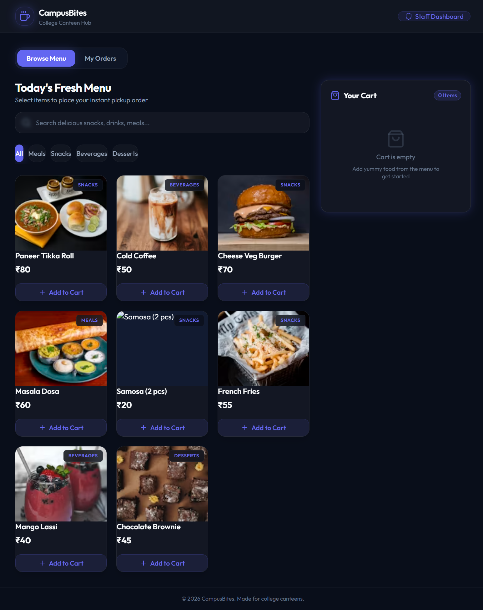

# Student Menu & Browse Page

## Page Details
- **Route:** `/`
- **React Component:** `StudentView.tsx` (imported and rendered in `App.tsx`)
- **Primary Styles:** Tailwind CSS with a custom slate-obsidian glassmorphic dark theme (`.glass-card`, `.glass-input`).
- **Associated Screenshots:**
  1. `01_student_menu.png` (Full height capture)
  2. `Screenshot 2026-07-01 192051.png` (Standard desktop browser view with active search/category filtering)

---

## 1. Functional Requirements
The student landing page serves as the user-facing storefront of the canteen. It must achieve the following:
1. **Dynamic Menu Fetching:** Fetch active dishes from the server (`GET /api/menu`) on mount and automatically poll for updates every 30 seconds.
2. **Offline Resilience:** If the server is offline or unreachable, display a visible alert banner (`Canteen server is offline. Retrying...`) and continuously retry fetching.
3. **Food Item Search:** Provide instant client-side keyword search matching text from the dish names.
4. **Category Filtering:** Allow category filtering via selectable badges ("All", "Meals", "Snacks", "Beverages", "Desserts").
5. **Interactive Shopping Cart:** 
   - Add items to the cart, increment/decrement quantities in-place, and remove items when quantity falls below 1.
   - Persist cart items in React state (`cart`), displaying current count, individual totals, and a grand total.
6. **Checkout Validation & Submission:**
   - Display a checkout form requiring "Your Full Name" and "Roll Number or Phone".
   - Validate that the fields are non-empty and the cart is populated before allowing submission.
   - Disable submission controls and display an "Ordering..." loading state during checkout.
   - Send order requests to the server (`POST /api/orders`).
7. **Order Tracking & Session History:**
   - Sync placed orders to local storage under `myOrdersList` to persist history across browser sessions.
   - Poll active (non-completed) orders every 5 seconds (`GET /api/orders/:id`) to retrieve live status updates (`PENDING` → `PREPARING` → `READY` → `COMPLETED`).
   - Play a notification chime sound (`https://assets.mixkit.co/active_storage/sfx/2869/2869-500.wav`) when an order status shifts to `READY`.
   - Provide a visual pickup ticket containing a 4-digit monospace OTP code and a high-contrast QR code.
   - Allow students to clear/remove completed orders from their history tab.

---

## 2. UI Layout Structure & Responsive Design
The page utilizes a responsive layout that automatically adjusts to screen sizes:

### 2.1. Navigation Header
- **Desktop/Mobile:** A sticky top navigation bar (`height: 64px`) styled with glassmorphism. It contains the **CampusBites** branding (logo and subtitle) on the left, and a navigation action button (**Staff Dashboard** or **Student Menu**) on the right.

### 2.2. View Mode Toggle
- Located at the top left of the main content area, a segmented control button allows the user to switch active panels between **Browse Menu** and **My Orders**. The **My Orders** button displays a green numeric badge indicating the count of active (non-completed) orders.

### 2.3. Food Catalog Panel (Browse Menu Tab)
- **Search Bar:** A full-width input container with a lock/search icon and glass styling.
- **Category Carousel:** A scrollable horizontal row containing pills/buttons for each food category.
- **Menu Items Grid:**
  - **Desktop (>1024px):** 3-column grid (`grid-cols-3` with `gap-5`).
  - **Tablet (768px - 1024px):** 2-column grid (`grid-cols-2` with `gap-5`).
  - **Mobile (<768px):** 1-column list (`grid-cols-1` with `gap-4`).
- **Food Card Anatomy:**
  - Image preview container with categorical category badge overlay.
  - Dish Title and Price tag (₹).
  - Add to Cart button (transitions to inline +/- controls once quantity > 0).

### 2.4. Checkout Panel (Browse Menu Tab)
- **Desktop:** Sticky right-hand sidebar (`width: 320px`) constrained to `max-h-[calc(100vh-140px)]` to prevent scrolling anomalies.
- **Mobile:** Collapses into a floating circular action button (FAB) displaying cart item count and total. Clicking this FAB triggers a bottom-sheet slide-up drawer (`animate-slide-up`) overlaying the viewport.
- **Anatomy:**
  - Cart header with count.
  - Scrollable item list showing dish name, quantity, unit price, and subtotal.
  - Checkout form inputs and **Place Order** button.

### 2.5. Placed Orders Panel (My Orders Tab)
- Displays ordered tickets in a vertical list, centered on the screen.
- **Ticket Anatomy:**
  - Header: Order number (e.g. `#1004`), relative placement time, and uppercase status badge (`PENDING` in yellow, `PREPARING` in blinking indigo, `READY` in bouncing green, `COMPLETED` in grey).
  - Body: List of items with totals, customer name, and a dedicated code box on the right.
  - Code Box: Displays the 4-digit OTP code in large monospace and a white padded QR code container.
  - Archiving: Completed orders hide the code box and display a "Remove from history" delete button.

---

## 3. Component State Behaviors
The view is driven by the following local React states:
- `menu` (`MenuItem[]`): Holds fetched database dishes.
- `selectedCategory` (`string`): Selected category filter (defaults to `'All'`).
- `searchQuery` (`string`): Text-filter string.
- `cart` (`CartItem[]`): Active shopping cart selections.
- `isCartOpen` (`boolean`): Controls mobile bottom sheet drawer visibility.
- `studentName` (`string`): Name entered into the checkout input.
- `studentRoll` (`string`): Roll number/phone entered into the checkout input.
- `myOrders` (`Order[]`): Current student's orders loaded from `localStorage` (`myOrdersList`).
- `activeSubTab` (`'menu' | 'orders'`): Active view selection (defaults to `'menu'`).
- `isSubmitting` (`boolean`): Disables submit button during API requests to prevent double-checkout.
- `isLoadingMenu` (`boolean`): Displays a loading spinner while fetching the initial menu list.
- `serverError` (`string`): Displays a warning message banner if API connections fail.

---

## 4. Button & Control Behaviors

| Button / UI Control | Event / Action | Navigates To / Result |
|:---|:---|:---|
| **CampusBites Logo** | Click | Navigates to `/` (reloads Student View and resets tab to Browse Menu). |
| **Staff Dashboard** | Click | Navigates to `/staff` (Redirects to `/staff/login` if unauthenticated). |
| **Browse Menu Tab** | Click | Updates `activeSubTab` state to `'menu'`, rendering the food catalog panel. |
| **My Orders Tab** | Click | Updates `activeSubTab` state to `'orders'`, rendering the placed orders history. |
| **Category Pill** | Click | Sets `selectedCategory` state. Highlights active pill and filters the menu grid. |
| **Add to Cart** | Click | Adds the item to the `cart` array with `quantity: 1`. Updates state in-place. |
| **Plus (+)** | Click | Increments target item `quantity` by 1 in the `cart` state. |
| **Minus (-)** | Click | Decrements target item `quantity` by 1. Removes item entirely if quantity reaches 0. |
| **Floating Mobile Cart** | Click | Sets `isCartOpen` state to `true`, revealing the bottom checkout sheet drawer. |
| **Close Cart Drawer (X)**| Click | Sets `isCartOpen` state to `false`, hiding the bottom sheet. |
| **Place Order Button** | Form Submit | Submits fields to `POST /api/orders`. On success, empties cart, sets `isCartOpen` to `false`, appends order to `myOrders`, saves to `localStorage`, and switches tab to `'orders'`. |
| **Delete History Icon** | Click | Calls `removeOrderFromHistory()`, filtering the item out of `myOrders` and updating `localStorage`. |
