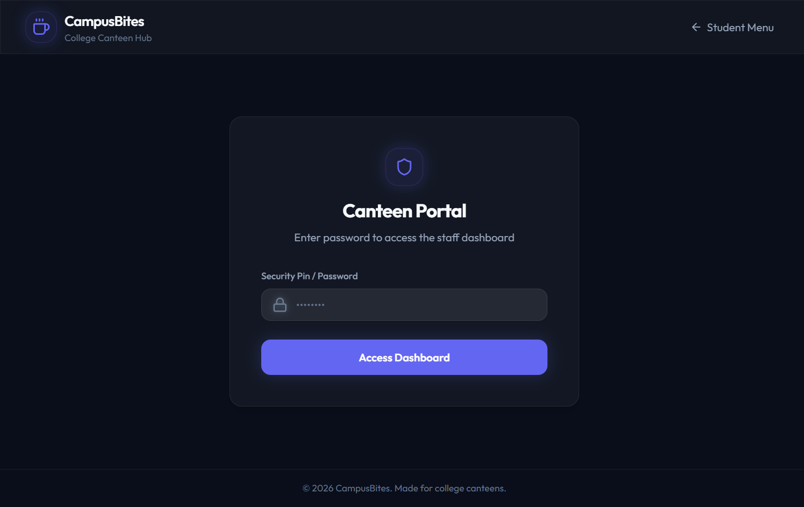

# Staff Login Page

## Page Details
- **Route:** `/staff/login`
- **React Component:** `StaffLogin.tsx` (imported and rendered in `App.tsx`)
- **Primary Styles:** Slate-obsidian glassmorphism with a centered card layout.
- **Associated Screenshot:** `02_staff_login.png` (stored in `docs/pics/`)

---

## 1. Functional Requirements
The Staff Login page provides a secure gatekeeper interface for canteen administrators. It must fulfill the following requirements:
1. **Password Authentication:** Capture a security pin or password from the staff user.
2. **Credential Verification:** Send a login request to the server API (`POST /api/auth/login`) with the payload `{ "password": "<entered_password>" }`.
3. **Session Initiation:** Upon a successful response (HTTP 200 with a valid token):
   - Save the returned JWT token in `localStorage` under the key `staffToken`.
   - Programmatically navigate the user to the active orders dashboard route (`/staff`).
4. **Error Handling & Reporting:**
   - Display a red alert banner (`bg-status-error/15 border-status-error/30 text-status-error`) containing specific error feedback.
   - Show validation errors instantly if the user tries to submit an empty form (`Please enter password`).
   - Report backend connection errors clearly if the canteen server is offline or unreachable (`Failed to connect to canteen server. Is backend running?`).
5. **Request De-duplication:** Disable the input fields and submit button during validation. Replace the button text with a spinning loader and "Verifying..." status text.

---

## 2. UI Layout Structure
The login interface uses a clean, focused, layout:
- **Navigation Header:** Persistent glassmorphic navbar. On this screen, the header displays the **CampusBites** logo/title on the left, and a **Student Menu** back-link (with left arrow icon) on the right.
- **Centered Card container:** A glassmorphic card (`.glass-card` with a maximum width of `md` / 448px) centered vertically and horizontally in the viewport.
- **Visual Branding Section:** 
  - Indigo-themed rounded-xl shield icon container (`Shield` from Lucide) with a soft glow effect.
  - Bold Title: "Canteen Portal" in Outfit font.
  - Subtitle: "Enter password to access the staff dashboard".
- **Authentication Form:**
  - Label: "Security Pin / Password" in a muted text size.
  - Input Container: Lock icon (`Lock` from Lucide) positioned inside a password-type input field. Restricts text visibility to bullets.
  - Submit Button: Indigo-accented full-width button. Supports scale transition (`active:scale-98`) and disabled states.
- **Error Banner:** Displays conditionally at the top of the form fields when error state is active.

---

## 3. Component State Behaviors
The view manages three main local states:
- `password` (`string`): Bound to the password input field. Cleared on error or on successful navigation.
- `error` (`string`): Contains error messages. Cleared automatically at the start of a login attempt.
- `isLoading` (`boolean`): Tracks active API requests. When `true`, disables form interaction and shows a loader icon (`Loader2` rotating).

---

## 4. Button & Control Behaviors

| Button / UI Control | Event / Action | Navigates To / Result |
|:---|:---|:---|
| **CampusBites Logo** | Click | Navigates to `/` (returns to Student View). |
| **Student Menu Link** | Click | Navigates to `/` (returns to Student View). |
| **Password Input** | `onChange` | Updates the local `password` state. |
| **Password Input (Enter key)** | Keypress | Triggers form submission, executing `handleLogin()`. |
| **Access Dashboard Button** | Click / Submit | Validates field presence, sets `isLoading` to `true`, and fires request to `POST /api/auth/login`. Redirects to `/staff` on success. |
