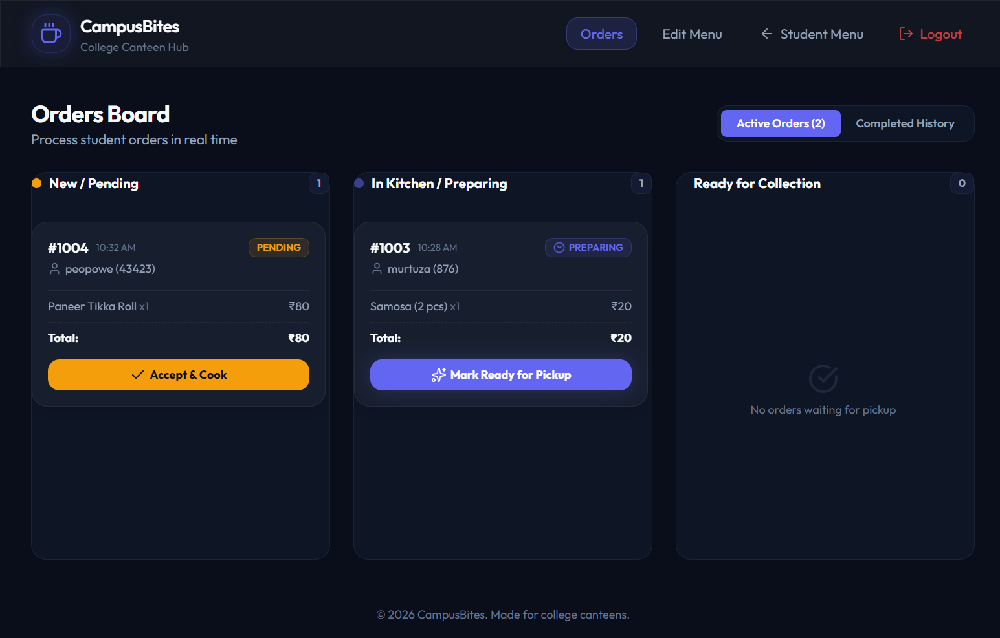

# Staff Orders Dashboard

## Page Details
- **Route:** `/staff`
- **React Component:** `StaffOrders.tsx` (nested inside the `StaffView.tsx` wrapper)
- **Primary Styles:** Dark theme Kanban board with independent column scrolling.
- **Associated Screenshots:**
  1. `03_staff_orders_dashboard.png` (Full height capture)
  2. `Screenshot 2026-07-01 192220.png` (Standard desktop browser view with active order tickets)

---

## 1. Functional Requirements
The Staff Orders Board is a real-time command center designed for canteen staff to process incoming orders. It must fulfill the following capabilities:
1. **Access Control Guard:** Require validation of `staffToken` in `localStorage`. If missing or invalid, redirect instantly to `/staff/login`.
2. **Real-time Order Syncing:** Retrieve all orders from the server (`GET /api/admin/orders`) on mount, and poll the server every 5 seconds to ensure real-time synchronization.
3. **Sound Alerts for New Orders:** Detect when the number of `PENDING` orders increases compared to the previous poll, and trigger an auditory alert chime (`https://assets.mixkit.co/active_storage/sfx/1018/1018-500.wav`) to notify kitchen staff of incoming items.
4. **Kanban Status Lifecycle Transitions:** Allow staff to advance order states in-place via API requests (`PATCH /api/admin/orders/:id/status`):
   - **PENDING → PREPARING:** Accept an order into the kitchen, moving it from Column 1 to Column 2.
   - **PREPARING → READY:** Complete cooking. Moves order to Column 3 and triggers a pickup alert and audio chime on the corresponding student's page.
   - **READY → COMPLETED:** Customer pays and collects their food. Moves the order out of the active board and archives it in the historical logs.
5. **View Mode Toggling:** Permit switching between the active Kanban board board and the Completed History log database.
6. **Token Destruction (Logout):** Allow staff to log out, which deletes `staffToken` from `localStorage` and redirects to `/`.

---

## 2. UI Layout Structure
The interface is structured for high throughput and glanceability:

### 2.1. Staff Header Navigation
- Displays the **CampusBites** logo and app title linking back to `/`.
- Includes tab links to switch between **Orders** (`/staff`) and **Edit Menu** (`/staff/menu`).
- Contains a **Student Menu** back link and a red-themed **Logout** button with a `LogOut` icon.

### 2.2. Sub-Header Toolbar
- Displays the page heading ("Orders Board") and its subtitle.
- Renders an orange connection alert banner if API polling fails (`Connection to backend lost. Reconnecting...`).
- Segmented buttons to select between **Active Orders (Count)** and **Completed History**.

### 2.3. Active Kanban Board Layout
- Divided into three columns aligned side-by-side on desktop.
- To prevent vertical page stretching, columns are set to a fixed height (`max-h-[70vh]`) with vertical scrolling (`overflow-y-auto`) enabled:
  1. **New / Pending Column:** Orange bullet status. Lists newly submitted tickets waiting for acceptance.
  2. **In Kitchen / Preparing Column:** Pulsing indigo bullet status. Lists accepted orders.
  3. **Ready for Collection Column:** Flashing green bullet status. Lists orders ready at the counter.
- **Order Ticket Cards:**
  - Glassmorphic card styling.
  - Header: Order number (e.g. `#1004`) and relative submission time.
  - Customer info: Student Name and Roll/Phone.
  - Items list: Shows dish names, quantities, and individual price calculations.
  - Subtotal: Grand total of the ticket.
  - OTP verification box (Only in the "Ready" column): Displays the 4-digit OTP code in large monospace characters (`Pickup Code`).

### 2.4. Completed History View
- Renders a table list when the "Completed History" tab is selected:
  - Columns: **Order Num**, **Student Detail** (Name and Roll), **Food Items** (comma-separated list), **Price**, **Pickup Time**, and **Status** (displays a green "Completed" check badge).

---

## 3. Component State & References
The component manages the following:
- `orders` (`Order[]`): Master list of all orders polled from backend.
- `activeTab` (`'ACTIVE' | 'COMPLETED'`): Currently selected view mode.
- `isLoading` (`boolean`): Shows a synchronization loader spinner during initial API fetch.
- `error` (`string`): Contains server connection failure error text.
- `prevPendingCount` (`useRef<number>`): Ref that caches the count of pending orders during the previous poll interval to trigger sounds when new orders arrive.

---

## 4. Button & Control Behaviors

| Button / UI Control | Event / Action | Navigates To / Result |
|:---|:---|:---|
| **CampusBites Logo** | Click | Navigates to `/` (returns to Student View). |
| **Orders Link** | Click | Renders active dashboard route (`/staff`). |
| **Edit Menu Link** | Click | Navigates to `/staff/menu` (Menu CRUD management). |
| **Student Menu Link** | Click | Navigates to `/` (returns to Student View). |
| **Logout Button** | Click | Triggers `handleLogout()`, removing `staffToken` and navigating to `/`. |
| **Active Orders Tab** | Click | Sets `activeTab` state to `'ACTIVE'`, displaying the 3-column Kanban board. |
| **Completed History Tab**| Click | Sets `activeTab` state to `'COMPLETED'`, displaying the archived table list. |
| **Accept & Cook** | Click | Triggers status update to `'PREPARING'`. Optimistically updates card to Kitchen column. |
| **Mark Ready for Pickup**| Click | Triggers status update to `'READY'`. Moves ticket to Collection column. |
| **Paid & Collected** | Click | Triggers status update to `'COMPLETED'`. Moves ticket to Completed History list. |
