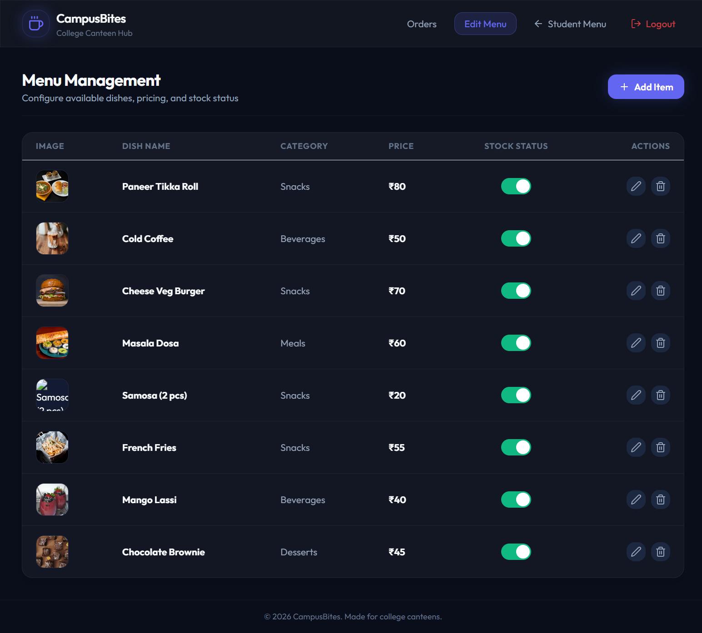

# Staff Menu Editor

## Page Details
- **Route:** `/staff/menu`
- **React Component:** `StaffMenu.tsx` (nested inside the `StaffView.tsx` wrapper)
- **Primary Styles:** Tabular grid with custom CSS switches and modal overlay form controls.
- **Associated Screenshot:** `04_staff_menu_editor.png` (stored in `docs/pics/`)

---

## 1. Functional Requirements
The Staff Menu Editor provides administrative CRUD (Create, Read, Update, Delete) capability over the canteen's food offerings. It must fulfill the following:
1. **Access Control Guard:** Require authentication. Redirect to `/staff/login` if `staffToken` is missing or invalid.
2. **Catalog Retrieval:** Retrieve all active menu items from the database (`GET /api/admin/menu`) on mount.
3. **Toggle In-Stock Availability:**
   - Provide a quick-toggle checkbox/switch for each dish.
   - Instantly update the item's `is_available` status (1 = In Stock, 0 = Out of Stock) in the database via `PUT /api/admin/menu/:id`.
   - Update the row style in-place (reducing opacity to `opacity-65` and adding an "Out of Stock" grey label) and grey out the item on the Student view.
4. **Create New Menu Item:**
   - Provide an "+ Add Item" modal form.
   - Accept input for Dish Name, Price (number), Category (dropdown: Meals, Snacks, Beverages, Desserts), and an optional image URL.
   - Send data to the backend via `POST /api/admin/menu`. Upon completion, re-fetch the menu list and close the modal.
5. **Update Existing Menu Item:**
   - Pre-fill the modal form with existing item values upon clicking "Edit".
   - Submit modified values to `PUT /api/admin/menu/:id`. Upon completion, refresh the catalog list and close the modal.
6. **Delete Menu Item:**
   - Guard deletion with a native browser confirmation prompt (`Are you sure you want to delete this menu item?`).
   - On confirmation, send a delete request to `DELETE /api/admin/menu/:id` and filter the item out of local state.
7. **Modal Reset:** Ensure closing or canceling the modal resets all form state variables to default values to prevent data leakage between add and edit sessions.

---

## 2. UI Layout Structure
The inventory management dashboard comprises the following sections:
- **Staff Header Navigation:** Persistent navigation bar with links to the **Orders** board, active **Edit Menu** highlight, a **Student Menu** back-link, and a **Logout** trigger.
- **Title Banner:** Shows the page name ("Menu Management"), subtitle, and an **Add Item** button in the top right (Indigo with a `Plus` icon).
- **Error Banner:** Displays errors (such as `Connection to canteen server offline.`) conditionally.
- **Inventory Data Table:**
  - Styled with glassmorphism and subtle borders (`.glass-card`).
  - Columns:
    1. **Image:** Small rounded thumbnail of the dish.
    2. **Dish Name:** Bold primary text. If out of stock, appends a small gray badge reading `OUT OF STOCK`.
    3. **Category:** Secondary colored badge representing the food category.
    4. **Price:** Bold price indicator prefixed with ₹.
    5. **Stock Status:** Custom-styled toggle switch pill (turns green when enabled, gray when disabled).
    6. **Actions:** Sub-grouped Edit (pencil icon) and Delete (trash icon) buttons in the far right.
- **Add / Edit Modal Overlay:**
  - Visible only when `isModalOpen` is `true`.
  - Stretched full screen overlay (`fixed inset-0 z-50 bg-black/75 backdrop-blur-xs`) that darkens and blurs the background.
  - Centered modal dialog containing input forms:
    - Text field: Dish Name (required, e.g. "Paneer Tikka Sandwich").
    - Numeric field: Price (required, supports steps of 0.5, e.g. "60").
    - Select dropdown: Category (predefined values: Meals, Snacks, Beverages, Desserts).
    - Text field: Image URL (optional).
    - Custom Switch: Set Item Available In-Stock.
  - Modal Footer buttons: Cancel (gray) and Create Dish / Save Changes (indigo with save icon).

---

## 3. Component State Behaviors
The component lifecycle is driven by the following local states:
- `menuItems` (`MenuItem[]`): Array holding active inventory items from the server.
- `isLoading` (`boolean`): Displays a loading spinner while fetching the initial menu list.
- `error` (`string`): Contains server connection failure messages.
- `isModalOpen` (`boolean`): Toggles overlay modal drawer visibility.
- `editingId` (`string | null`): Identifies the item being modified. If `null`, the modal behaves in "Create" mode.
- **Form States:**
  - `name` (`string`): Bound to Dish Name input.
  - `price` (`string`): Bound to Price input.
  - `category` (`string`): Selected category option (defaults to `'Snacks'`).
  - `imageUrl` (`string`): Bound to Image URL input.
  - `isAvailable` (`boolean`): Checkbox state indicating stock availability.

---

## 4. Button & Control Behaviors

| Button / UI Control | Event / Action | Navigates To / Result |
|:---|:---|:---|
| **CampusBites Logo** | Click | Navigates to `/` (returns to Student View). |
| **Orders Link** | Click | Navigates to `/staff` (returns to Orders dashboard). |
| **Edit Menu Link** | Click | Renders current menu editor dashboard. |
| **Student Menu Link** | Click | Navigates to `/` (returns to Student View). |
| **Logout Button** | Click | Clears `staffToken` and redirects to `/`. |
| **Add Item Button** | Click | Calls `handleOpenAddModal()`, resetting form states, setting `editingId` to `null`, and opening the modal. |
| **Edit Button (Row)** | Click | Calls `handleOpenEditModal()`, pre-filling form states with the selected row's data, setting `editingId` to the item ID, and opening the modal. |
| **Delete Button (Row)** | Click | Triggers confirmation. On success, calls `DELETE /api/admin/menu/:id` and updates local state. |
| **Stock Switch (Row)** | Click | Invokes `handleToggleAvailability()`, switching `is_available` between `1` and `0` via API call. |
| **Cancel Button (Modal)**| Click | Closes the modal. Resets form fields. |
| **Save/Create Button (Modal)**| Click / Form Submit| Validates inputs. Sends `POST` (create) or `PUT` (edit) requests. Reloads menu list on success and closes modal. |
